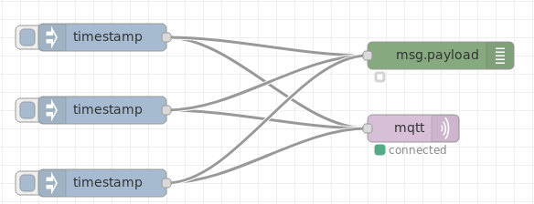
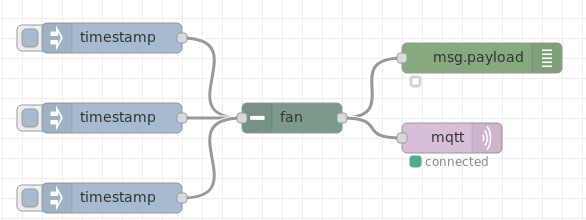

# node-red-contrib-fan
A simple Node Red node that can be used to allow flows to be fanned in or out to reduce clutter in the editor.  
Messages are passed through this node without any modification.

Changes this

into this

