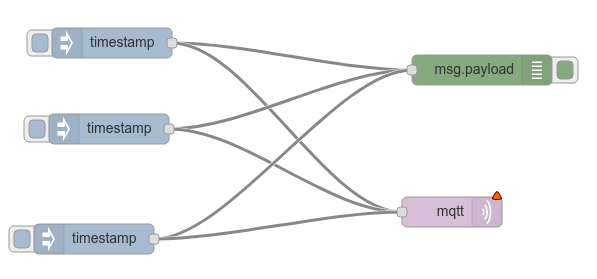
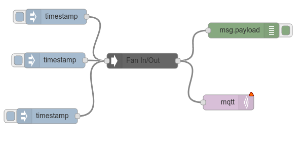

# node-red-contrib-fan
A simple Node Red node that can be used to allow flows to be fanned in or out to reduce clutter in the editor.

Changes this

into this

Messages are simply passed through this node.
